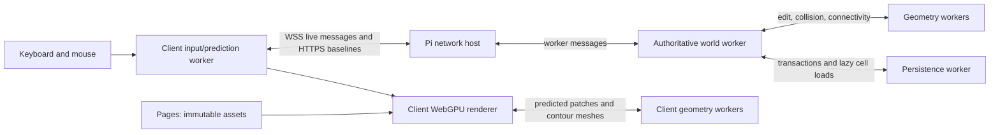

# Multiplayer and destruction implementation

The agreed scope and implementation record, updated October 2026.
See the [original architecture review](multiplayer-and-destruction-review.md)
and the [Pages/Pi deployment guide](deployment.md).

## Agreed scope

- Keep cooperative building and existing movement, swimming, stamina, oxygen,
  doors, cutting, repair, and falling pieces. Add no HP, combat, economy, accounts,
  or other gameplay.
- Anyone with the link can choose a nickname and join. The browser remembers an
  anonymous identity. Other players have capsule figures and text nicknames.
- Player contact blocks and slides horizontally; players provide no standing
  surface and cannot stack.
- Persist world edits, positions, stamina, and oxygen. Disconnect removes the
  capsule and pauses offline vitals. Existing oxygen respawn behavior continues.
- Keep TypeScript and existing Rapier use. Reuse edited-solid queries on the
  server; add no Rust, new physics features, or character-controller migration.
- Use WebSocket, a Pages client, and a Raspberry Pi authority through Tunnel.
  Use free infrastructure. Budgeting is outside this work.
- Delete the old test save. No migration, legacy save loader, or old transport
  compatibility.
- At most one live client for current testing. Ten is a later testing target,
  not an admission cap or capacity claim. No live two-player/ten-player tests.

## Responsibility and execution

Rendering, vegetation, terrain streaming, detailed contours, previews, and first
visible destruction remain client work. Pages delivers immutable assets. The Pi
owns positions, vitals, accepted edits, support, fragment motion, and persistence.
Client meshes and support calculations are never trusted world state.

The HTTP/WebSocket host handles bounded decoding and connections. One world
worker owns mutable state. Geometry has independent edit/collision and component
lanes so a large connectivity job cannot occupy the cut worker. Both lanes warm
before player admission, keeping module startup out of the first stroke. Compression,
checksums, disk I/O, and fsync run in the journal worker. Durable edits activate
at a world tick boundary.

Cloudflare does not execute this simulation or remove live traffic to the Pi.
The split moves presentation costs to browsers while retaining shared decisions
on the authority.

## Transport

One WSS connection carries ordered commands, receipts, reliable world edits,
input batches, player snapshots, and fragment poses. HTTPS carries bulk cell
baselines outside the live socket's application queue. This follows documented
[WebSocket support](https://developers.cloudflare.com/network/websockets/) and
[Tunnel published application protocols](https://developers.cloudflare.com/cloudflare-one/networks/connectors/cloudflare-tunnel/routing-to-tunnel/protocols/).

Messages use a versioned binary value codec and packed `Int16Array` distance
bricks. Player snapshots initially contain complete bounded replay state.
Advanced bit packing and delta negotiation are deferred. TCP loss still blocks
later bytes; prediction, interpolation, small snapshots, queue limits, and
reconnect mitigate that experience without providing unreliable delivery.

Inputs have at most 24 steps per message and 120 queued steps. Incoming socket
messages are limited to 32 KiB, 120 messages/second, and 128 KiB/second. Pending
commands, subscriptions, bulk groups, and decoded collections are bounded.
Transient snapshots can be skipped under backpressure; reliable queue overflow
closes the socket and forces fresh state.

A browser identity can have one active capsule. A second active tab is rejected.
The server issues an opaque live connection handle; HTTP region loads must belong
to its current subscription. Production Origin checks and plain-text nickname
rendering are implemented. These are connection bounds, not authenticated
accounts or access control.

### Secure WebTransport alternatives, unimplemented

The public Tunnel protocol table does not document native browser WebTransport
ingress. This is a documentation-based conclusion, not a live test against the
user's domain. QUIC on the `cloudflared` leg does not create browser-to-Pi
unreliable datagrams. [Tunnel configuration](https://developers.cloudflare.com/tunnel/configuration/).

| Option | Evaluation |
| --- | --- |
| Direct HTTP/3 on a DNS-only Pi hostname | Needs reachable UDP, home routing/NAT, trusted TLS and a browser-compatible endpoint. Changes the selected exposure and ingress. |
| Public WebTransport relay with a Tunnel WebSocket backhaul | Requires another reachable host. The reliable Pi backhaul can still stall; no free relay is assumed. |
| Specialized UDP proxy | Requires separate product/routing validation. Spectrum custom UDP is documented under Enterprise, outside this free Tunnel path. [Protocol availability](https://developers.cloudflare.com/spectrum/protocols-per-plan/). |
| WebSocket compatibility wrapper | Retains TCP semantics while preserving an API shape. Little benefit here. |

Primary investigation sources are the [W3C specification](https://www.w3.org/TR/webtransport/),
[webtransport-go](https://github.com/quic-go/webtransport-go), and the
[Node/C++ implementation](https://github.com/fails-components/webtransport).
Verify browser/ARM compatibility, trusted production TLS, allowed Origin,
admission/message limits, and datagram sizes before adopting one. Rust is not
required by these options. No extra transport backend is installed now.

## Simulation and replication

World orchestration runs at 30 Hz, character movement/vitals at existing 120 Hz,
falling bodies at existing 60 Hz, and player snapshots target 20 Hz. Catch-up is
bounded. Inputs are sequenced fixed-duration steps, not client positions or delta
times. Missing input uses neutral controls.

Complete capture/restore includes feet, velocity, grounding, jump timers,
swimming, sprint/exhaustion, stamina, oxygen, and home/respawn state. The client
worker predicts immediately, restores acknowledged server state, and replays
unacknowledged input. Water animation uses world time. Daylight settings remain
cosmetic and local.

Other players render about 100 ms behind server time. Contact uses existing
character sweeps with analytic capsule blockers and deterministic horizontal
separation on the server, constrained by world collision. Remote capsules do not
enter terrain/standing support. Avatar movement invalidates the renderer's
instance cache even when the local camera stands still.

Movement queries use canonical two-meter terrain triangles and the same cooked
edited-solid boxes on both sides. Detailed meshes do not choose collision.
Rapier broadphase refresh does not advance live falling bodies. Local-origin
query worlds prune distant native colliders.

Commands reference the input sequence they depend on. Server state supplies
eye/feet/standing; consumed-input timestamps supply destruction cadence. Reach,
visibility, revision, eligibility, and existing placement/repair rules are checked
on the authority. Stable request IDs and durable compact receipts handle retries.
Building dependencies remain ordered; visible cuts do not wait for one round
trip before allowing the next stroke.

World changes carry per-object revisions. An older global partial baseline may
introduce an unseen object, but cannot overwrite a newer version of that object.
Baseline requests use subscription generations. Newer world/motion events buffer
with limits during loading and replay afterward. Superseded/disconnected loads
fail instead of hanging or replacing newer subscriptions. Reconnect resets old
input/interpolation history and obtains a fresh baseline.

## Sparse world and saves

Spatial indexes bound player interest and placed-object queries. Dynamic interest
uses 128 m cells. Existing 512 m build cells remain the storage/presentation scale;
terrain subchunks retain their separate rendering hierarchy. Edited solids are
indexed by all cells touched by their bounds and their original cell.

One process hosts one authority. No gateway service, leases, border handoff,
sharding, or dynamic cell ownership is added. Current cell/query interfaces leave
room for later subdivision without introducing unused distributed machinery.

The unified journal commits a build and a damaged-wall aperture atomically. Cuts
commit support-pending markers with geometry; collapse is a later transaction.
Compact receipts survive restart within a 512-receipt history. An expired/unknown
confirmation requires region refresh; retry history is bounded.

Records are binary, compressed, checksummed, sequenced, and flushed before
acceptance. Checkpoints use flushed snapshots and atomic head publication. A
partial final frame is recoverable; complete corruption is an error. Projection
failure after durable append halts journal work until restart, which rebuilds
cell files from committed state.

Players/vitals and motion save roughly once per second, plus disconnect/clean
shutdown flushes. A hard crash can roll these transient states back by the
checkpoint interval. Accepted edits have the stronger durable-ack guarantee.
Offline vitals pause. Saved underwater positions are eligible for restoration;
an occupied position relocates nearby while keeping saved vitals.

Edited-volume archives hydrate on demand. Players, active fragments, and pending
support protect necessary records. Edited records and collision/component caches
have resident limits, and no-player cleanup releases idle volumes. Client region
exit releases edited geometry/query entries. Small build metadata, grading, and
opening indexes remain resident; fully paged metadata is not implemented.

## Destruction approach and fixes

The hybrid approach remains appropriate: ordinary geometry for intact scenery,
sparse distances for damage, client contours for appearance, and authoritative
support/falling behavior. Fully voxelizing the island or adding general rigid-body
construction would add work beyond this scope.

Edited bricks use packed signed 16-bit distances. Skin clipping appears first;
sparse edit/contour prediction runs in a client worker. Full-object meshes and
optional distant LODs follow separately. Collision cooking precedes authoritative
activation and does not wait for the detailed render mesh. Reliable changes
currently send the object's full current sparse volume, not dirty-brick deltas.

Native 2.5 cm connectivity prevents thin gaps from being bridged by coarse
samples. Anchored propagation uses spatial queries and yields between long
batches. Support validates geometry, placement, terrain, and pose dependencies.
Per-target preparation permits unrelated edits to prepare independently; global
serialization covers durable commits/activation. Collision caches identify the
actual prepared volume, preventing competing jobs for one revision from sharing
the wrong geometry.

Fragment motion sends poses/velocity independently of volumes. Delayed motion
saves cannot roll newer live poses backward. Existing falling regions refresh
terrain as bodies travel and transfer installation across local origins. Static
query copies cannot appear as extra simulated bodies.

## Verification and limits

Run `npm test`, `npm run typecheck`, `npm run build`, and `npm run build:server`.
Focused tests cover replay, input bounds, player blocking/no stacking, binary
decoding, partial snapshot ordering, archive reload, atomic aperture/save failure,
journal truncation/checkpoints, paused vitals, slow support, native thin gaps,
and delayed motion writes.

`npm run check:multiplayer` owns an isolated server/save and one Chrome page. It
checks joining, real movement input, placement, cutting, and reload. The retained
building/destruction/prediction/daylight/catalogue browser commands currently
delegate to this common smoke check. Their former broad browser scenarios are
not claimed as current coverage; existing gameplay unit suites remain.

The Pi, actual Tunnel/domain, ARM runtime, impaired networks, multi-player visual
contacts, crowds, and ten-player capacity have not been locally validated. Do
not run live two-player/ten-player tests without a new request. There is no
ten-player admission cap. `?netdebug=1` exposes RTT/snapshot/correction figures;
server diagnostics expose tick and geometry-stage timings.

Remaining tradeoffs include full object-volume events/player snapshots, coarse
edited collision boxes, native connectivity cost for large trees, resident
metadata, and replay against current collision state rather than historical
geometry. These are measurable follow-ups, not reasons to add transport stacks
or combat rewind now.

The local suite passes 153 tests in 21 files. Client/server production builds and
a local bundled-server readiness/Origin smoke check pass on Windows/Node 24.
The latest one-browser run also waits for finished damaged geometry and checks
WebGPU errors. It measured about 6 ms to the first visible cut and 430 ms to
confirmation, with server p95 tick work about 2 ms. These are individual
development samples, not Pi targets; detailed meshing remains independent.

## Recommendations

1. Deploy through the Pages/Tunnel configuration and verify with one browser
   before making Pi capacity claims.
2. Keep WebSocket and hybrid destruction. Measure authority, collision, and
   geometry-worker costs before considering a transport rewrite.
3. Measure large-tree confirmation/support time and resident bytes on the Pi.
   Add dirty-brick replication and incremental connectivity when justified.
4. Keep presentation heavy on clients and immutable delivery on Pages, while
   retaining shared movement, edit validation, support, and saves on the Pi.
5. Retain sparse spatial boundaries; page metadata or subdivide storage when
   actual workloads require it. Defer Rust, expanded Rapier, extra gateways,
   and distributed ownership.
